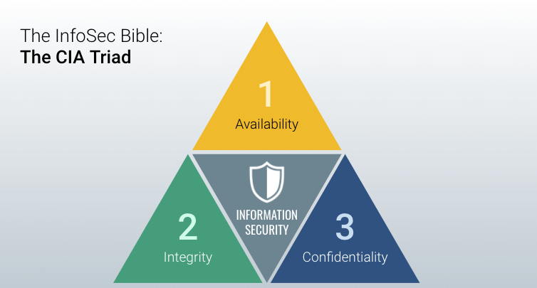

## 1.2 Student Guide: Surveying Cyberspace

### Overview 
In this class, we will cover the CIA triad, conduct research on specific vulnerabilities and threats, and will learn about cybersecurity roles and pathways. 

### Class Objectives

By the end of class, you will be able to: 

* Articulate a clear definition of the CIA Triad and its elements. 
* Define and contextualize technical terms found in recent cybersecurity trend reports. 
* Conduct research and analysis on a vulnerability, exploit, or threat actor to present to a non-technical audience using independent research. 
* Articulate roles and career pathways within the cybersecurity space.

### Slideshow

The lesson slides are available on Google Drive here: [1.2 Slides](https://docs.google.com/presentation/d/1jD8VxhoiaRE9-mtSAVa8eVNZvXEjAJ4A1PiMB5bUSDk)

- **Note:** Editing access is not available for this document. If you wish to modify the slides, please create a copy by navigating to File > "Make a copy...". 

---

### 01. Welcome and Overview  (0:10)

In the previous class, you were introduced to the structure of the course and the staff who will be supporting you. We also covered the rise of cybersecurity and what it entails. Then, we dug into a thought exercise around attack and defense, and concluded with frameworks. 

* Cybersecurity focuses on two primary concepts: 

  * **Threat assessment**, the structured process of identifying the risks posed to a group or system.

  * **Risk mitigation**, the systematic reduction of the impact and/or the likely occurrence of a negative event. 

- So, why do we use the word "mitigation" and not "eradication"? 

  - We cannot eradicate all risks. Since cybersecurity is always evolving, new threats show up every day. Also, business needs and budgetary constraints often limit what cybersecurity best practices we can implement. So we must do our best to mitigate.

  

- A hacker can see every single aspect of a web application—the webpage, the server, the database, even the users and administrators—as a potential target. 

  

Today's class is focused on the theme of *seeing the big picture*.

  - Throughout this course, you will be learning about many complex topics in-depth. While learning the skills attached to these topics are important, understanding the context behind them is even more crucial.
  
  - In today's lesson in particular, you will be diving into the broad field of cybersecurity and getting more comfortable navigating it by learning key terms and resources, and understanding some common career pathways.

### 02. Defining the CIA Triad (0:10)

Now we'll investigate the three cornerstones of information security: **Confidentiality**, **Integrity**, and **Availability**.

Try to define the three key terms in your own words: What is confidentiality? What is integrity? What is availability?

- **Confidentiality**: The state of keeping or being kept secret or private. 
  
  - This corner of the CIA triad is all about ensuring sensitive information does not reach unauthorized people. 
  
  - Some examples of confidentiality attacks include uploading private photos and communications onto a forum or having credit card numbers exposed online. 
  
  - Confidentiality comes down to the principle of "need to know." Data or information should only be made available to those who *need* access to it. 
  
  - Confidentiality is supported or enforced through other various measures, like encryption and authentication. 

- **Integrity**:  The quality of being honest, whole, or undivided. 

  - The integrity of information refers to protecting information from being modified by unauthorized parties. 

  - Some examples of integrity attacks include intercepting money transfers and changing the dollar amount in seemingly insignificant ways to allow the difference to be siphoned off, or altering grades on a university system to be better or worse. 

  - These kinds of attacks can be prevented by making sure there is a secure hashing algorithm and process when transferring data to make sure it can't be altered in transit.

- **Availability**: The quality of being able to be used or obtained. 

  - Availability concerns occur when operating systems, equipment, and data are not functioning correctly and thus are not accessible by those who need them. 

  - Some examples of an availability attack include hackers taking down a web-connected generator to disable a critical power supply, or using a denial of service (DoS) attack to bring down a financial service provider's website to make it impossible for clients to make transactions. 

  - Creating regular backups of data is one way to maintain availability.

Cybersecurity is concerned with the confidentiality, privacy, and integrity of data and data systems.

* We will revisit these terms throughout the program and will explain how the various topics, skills, and practices are concerned with protecting confidentiality, privacy, and integrity.

### 03. Activity: CIA Triad and Security Scenarios (0:12)
- [Activity File: CIA Triad and Security Scenarios](./Activities/03_STU_CIATriad/Unsolved/Readme.md)
- [Solution Guide: CIA Triad and Security Scenarios](./Activities/03_STU_CIATriad/Solved/Readme.md)

### 04. Review: CIA Triad and Security Scenarios (0:08)

### 05. Kaspersky + Fortinet Map (0:10)

There are such a vast number of attacks that fit into each category of the CIA triad that newcomers to the field often find it hard to learn them all. There are a lot of threats, a lot of technologies, and a lot of players, which make it challenging to visualize what is going on.

  

* Thankfully, security maps like [Kaspersky's](https://cybermap.kaspersky.com/) visualize the current cybersecurity landscape, giving a great overview of "real-time" security threats.

  * Navigate around the Kaspersky map for a while, clicking on individual countries to see what kinds of threats are being detected in those nations. Also go to the [Data Sources](https://cybermap.kaspersky.com/subsystems/) section to see what each of the lines represent.

  * Kaspersky is not the only visualizer of cyber threats. Go to [Fortinet](https://threatmap.fortiguard.com/) to see a similar map of attacks. 

### 06. Kaspersky and Fortinet Map Exploration (0:10)

### 07. Group Do: Threat Research  (0:45)

While this program focuses primarily on the hard skills needed in cybersecurity, soft skills such as *collaboration* and *communication* are also a huge component.

* Cybersecurity is an organizational responsibility, which means that many people are involved. As a security professional, you will be working and communicating with a variety of stakeholders.

* Cybersecurity often involves communicating highly technical information to a non-technical audience.
  * Developing your presentation skills is another critical skill. This includes public speaking, creating compelling slide visuals, and crafting a narrative for your information.
  
  * Being able to speak a common language with your audience and adjusting your message and language depending on the technical background of your audience is equally important.

* Throughout this program, you will work on three group projects in which you will get to practice and hone these soft skills.

### 08. Break (0:15)

### 09. Cybersecurity Domains (0:15)

Read the following quote from Tao Security's Richard Bejtlich on entering the cybersecurity field.

* _Providing advice on “getting started in digital security” is similar to providing advice on “getting started in medicine”: If you ask a neurosurgeon, he or she may propose some sort of experiment with dead frog legs and batteries. If you ask a dermatologist you might get advice on protection from the sun whenever you go outside. Asking a “security person” will likewise result in many different responses, depending on the individual’s background and tastes._

The field of cybersecurity is so vast that it is often hard to get straightforward advice on how to enter the industry. This is because the advice of each professional will vary depending upon their background and tastes.

  

This map shows various cybersecurity domains and roles:

* **Security architecture**: A unified security design that addresses the necessities and potential risks involved in a certain scenario or environment. It also specifies when and where to apply security controls. The design process is generally reproducible. ([Source](https://www.oreilly.com/library/view/effective-cybersecurity-a/9780134772929/))

* **Security operations**: The process that identifies critical information to determine if friendly actions can be observed by enemy intelligence, determines if information obtained by adversaries could be interpreted to be useful to them, and then executes selected measures that eliminate or reduce adversary exploitation of friendly critical information. ([Source](https://fas.org/irp/doddir/dod/jp3_13_3.pdf))

* **Governance**: The framework for managing performance and risk, oversight of compliance and control responsibilities, and defining the cyber mission by mapping the structure, authority, and processes to create an effective program. ([Source](https://bluelance.com/cybersecurity-governance))

* **Physical security**: The protection of personnel, hardware, software, networks and data from physical actions and events that could cause serious loss or damage to an enterprise, agency or institution. This includes protection from fire, flood, natural disasters, burglary, theft, vandalism, and terrorism. ([Source](https://books.google.com/books/about/HIMSS_Dictionary_of_Healthcare_Informati.html?id=AEowBQAAQBAJ))

* **Threat intelligence**: Evidence-based knowledge, including context, mechanisms, indicators, implications and actionable advice, about an existing or emerging threat to assets that can be used to inform decisions about responding to that threat. ([Source](https://www.gartner.com/en/documents/2487216/definition-threat-intelligence))

* **Career development**: The training of future cybersecurity professionals.

* **Risk assessment**: Analyzes what can go wrong, how likely it is to happen, what the potential consequences are, and how tolerable the identified risk is.

* **User education**: The process of teaching users how to protect themselves from cyberattacks by informing them of risks, exploits, and external threats as well as teaching them the skills needed to combat common attacks.

* **Framework and standards**: The creation of new security frameworks amd practices for professionals to adhere to. 

Our program is primarily concerned with the technical aspects of cybersecurity, but we will connect these areas to the overall security organization and business.

* We'll dive deep into security operations and security architecture in this course. We'll also dive into penetration testing, and discuss red team vs. blue team in depth.

* Governance and risk assessment are two of the primary topics we'll look at next week. We'll also discuss the importance of user education and training. We'll discuss physical security through the use of items like physical key cards, and the implementation of disaster recovery planning.

* Throughout this course, we will discuss different frameworks and standards. It is important to understand how these affect the development and priorities of a security organization. It's also important to note that different industries follow different frameworks, which we'll discuss next week. 

### 10. Cybersecurity Careers Research (0:10)

### 11.  Cybersecurity Roles and Pathways (0:20)

It's important for you to assess your existing skills and job level:
 
* Are you a career switcher or starter? Are you entering the security field for the first time? 

* If you have existing experience, what is it? Possibilities include:
    * Technical cybersecurity-adjacent fields, such as IT and networking. 
    * Technical experience, such as software development.
    * Security experience, such as SOC operations, security analysis, and security risk analysis and policy.

Similar jobs titles can have different skills and qualifications, so it's important to read the specifics of a job description. 

* You'll notice that many jobs, such as security analyst, don't necessarily expect candidates to have a lot of specific skills and tools. Many of these companies are open to teaching employees on the job. What's important is showing your passion as well as ability and willingness to learn. 

* Passion and ability to learn is key. This program will push you past your comfort zones, but *learning how to learn* is a critical skill that employers look for. 
  - Also, always stay curious and keep up to date on cybersecurity news and trends. Complete projects and participate in activities like CTFs (*capture the flag* competitions). In interviews, you should be able to talk about and demonstrate your passion and how you learn. 

* Do not be deterred by jobs that require a few more years of experience than what you have. If you are just starting out, a job that requires 6-8 years of experience is most likely out of reach, but a job that requires 2 years of experience is often not. 

  * Employers will often intentionally put higher years of experience than a job actually requires in order to avoid too many applicants. 

Note the following statistics:

* According to a report from Frost and Sullivan and (ISC)2 there will be more than 1.5 million unfilled cybersecurity positions by 2020.

  * A similar report by ISACA found that 53% of organizations experience delays as long as six months to find qualified cybersecurity candidates, that cybersecurity jobs grew three times as quickly as IT jobs between 2010-2014, and that 84% of organizations believe that 50% or less of their applicants for open security jobs are qualified. 

  * Also, according to (ISC)2, a full 87% of all cybersecurity professionals started their careers in a different field. This means that the majority of cybersecurity professionals have backgrounds similar to yours.

In general, the cybersecurity industry is looking for proven experience when hiring. If you’re new to the field, you will need to put in work to get started.

* However, it's important to note that because of the increased demand for security professionals, you can probably skip some of the years of required experience for certain jobs. We have had complete beginners in our program get jobs as network administrators, SOC analysts, and security analysts. 

* Now discuss common job titles and where they fit along different pathways.

  * **IT support specialists,** **computer help desk specialists**, and other similar titles are entry-level jobs for all beginners. 
  
  * **Systems administrator** and **network administrator** jobs are also entry-level jobs in the networking space. 
  
    * Technical cybersecurity roles require a strong foundation in networking, which our program covers. We also provide relevant cybersecurity context to our networking modules, so that they are still relevant for those of you who already have sysadmin or networking experience. These are roles that are within reach for career switchers and starters.
  
    * Networking roles focus on configuring and maintaining networks, and often include security-related tasks such as monitoring logs, implementing firewalls, and maintaining network-based backups. 

* There are a range of entry level security jobs focused on the operations and defensive side of security. Our program will equip you with the skills to obtain these roles, which many of our graduates have done.
 
  * **SOC analyst** is the most common entry-level security job. Specifically a Tier 1 SOC analyst can be hired with no prior professional experience. They work at Security Operations Centers within an organization, monitoring and analyzing network traffic. 
    - They are the first level of defense and are responsible for monitoring the security of users, systems, and the network. They detect and investigate suspicious and potentially malicious activity on the network and within systems
 
  * **Security or information specialists/analysts** encompass different skill levels and responsibilities, so it is important to always read the job description, specific skills, and qualifications. These roles actively protect an organization from security threats and breaches. 
    - Common responsibilities for entry-level roles include keeping up-to-date with security improvements, monitoring and protecting security systems, implementing security tools and protocols, developing security requirements, analyzing security policies and protocols for weaknesses and flaws, and designing and developing training. 
 
  * **Information assurance technicians** protect computer assets by establishing and documenting access and maintaining files.
 
  * **Forensics specialists** come in after a crime has been committed. They  analyze logs and other data to determine what occurred. 
    - Some common responsibilities include conducting security incident investigations, recovering and examining data from computers and other devices, compiling evidence for legal cases, writing technical reports, preparing evidence for trial, and working with law enforcement on the validity and preservation of data. 
  
  * **Risk analysts** use their knowledge and experience to examine systems and procedures to identify potential adverse events, including hardware and software crashes, physical disasters, malicious intruders, malware, denial of service attacks, and employee misconduct. 
  
  * **IT auditors** are responsible for the internal controls and risks to a company’s technology network. This role includes identifying the weaknesses in a systems network and creating an action plan to prevent security breeches in the technology.

* Typically, with some years of experience in the above roles, people can move on to mid-level to advanced roles such as the ones below. Many mid-level and advanced-level roles may also require additional certifications. 
  
  * **Security engineers** test the network for vulnerabilities, monitor for security breaches, and develop security plans and policies. 
    - Common responsibilities include installing and configuring firewalls and intrusion detection systems, performing vulnerability testing and security assessments, evaluate new technologies,  testing existing security solutions, and defining, implementing, and maintaining security policies. 
    - Many of these responsibilities are similar to those of a security analyst, but are more advanced and often more technical.
  
  * **Penetration testers** or **ethical hackers** are often hired by a company to test and break into their security controls and defenses and identify and report vulnerabilities and flaws in a system, using specific tools to simulate cyberattacks. 
    - Their goal is to help companies improve their security posture. Pentesters need to deeply understand the types of systems they’re trying to break into. They usually specialize in specific systems, such as networks, web applications, and mobile applications. 

* **Chief Information Officers (CIO)** and **Chief Information Security Officers (CISO)** are advanced managerial level roles in cybersecurity. Certifications such as CISSP+ are often required.

### 12. Using our Career Services Department (0:05)

The Career Services department is available from the first day of the program. 

* While we will tie concepts and skills in our program to career outcomes and roles, the Career Services team will do the practical, hard work of helping you obtain a new role or promotion.

* There are several career milestones for you to complete. 

  * You have access to them all now and can submit milestones whenever you want.
  * However, you will need to submit at least one milestone in order to unlock Career Services. 
  * One of the milestones, an updated, polished resume, is a requirement in a later homework assignment. You can submit this earlier if you'd like. 
  * Review the slides on Becoming Employer Competitive, Working with Your Profile Coach, and Working with Your Career Director.

* This week's homework contains more details about Career Services. If you do not know who your Career Director is, reach out to your Student Success Manager. 

---

### Copyright

Trilogy Education Services © 2020. All Rights Reserved.
