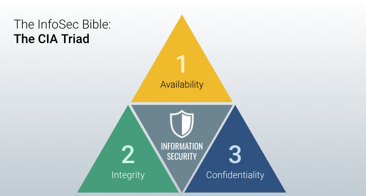

## 1.3 Lesson Plan: Certifications and Security+ 

### Overview

During today's class, you will deliver your group presentations. Following presentations will be an overview of cybersecurity certifications and an in-depth look at the Security+ exam. 

### Class Objectives

By the end of class you will be able to:

  * Explain the different certifications available to security professionals.

  * Articulate what the Security+ exam is and which InfoSec fields benefit from obtaining the certification.

  * Answer sample practice questions from the Security+ exam. 

### Slideshow

- The lesson slides are available on Google Drive here: [1.3 Slides](https://docs.google.com/presentation/d/1gdRclmLfEdEaRhTCDhQYGcGwUzAz-CrD7t3ayaod96I)


- **Note:** Editing access is not available for this document. If you wish to modify the slides, please create a copy by navigating to File > "Make a copy...". 

---

### 01. Welcome and Today's Themes (0:05)

In this lesson, you will receive an introduction to the Security+ exam. We will also cover some basic information and topics in this exam, but you will become familiar with more topics as the course progresses.

Next week, we will dive into the security organization and will look at topics such as governance, risk, and compliance. Following the GRC week, the program will focus on many of the technical aspects of networking and cybersecurity. 

### 02. Quick Review (0:05)

Let's review the topics of the previous lesson:

  * The CIA triad: The framework that captures the fundamental goals of information security: Confidentiality, Integrity, and Availability.

    

  * Confidentiality: Assurance that sensitive information is protected from reaches of unauthorized persons. 
    
    - Example of breach: A banking breach releases credit card info into the public.

  * Integrity: Protection of information from being modified or tampered by unauthorized persons. 
  
    - Example of breach: Student modifies official grades for himself and his friends. 

  * Availability: Accessibility of properly functioning operating systems, equipment, and data to all those who need it. 
  
    - Example of breach: Hackers disable a website through a denial of service (DoS) attack.

In many of the units in this course, we will explain how the tools and methodologies we're studying relate to the CIA Triad.

### 03. Research Presentations (1:30)

### 04. Break (0:40)

### 05. Cybersecurity Certifications (0:10)

As the demand for cybersecurity careers grows, employers frequently look for certifications as a proof of employee qualifications and training when hiring candidates.

- If you are serious about advancing your career in security, certifications are an important step towards more opportunity, knowledge, and skills. Certifications can be used across jobs and organizations.

- Note that it is possible to obtain an entry-level security job without any certifications. For example an SOC analyst is a common job that often does not require any certifications. For career starters, many networking jobs such as systems or network administrators also do not require certifications. 

Certifications are obtained through accrediting organizations. Here is a list of top providers, with a few of the certifications they offer:

- CompTIA: Security+, PenTest+
- GIAC: GPEN, GCIH
- ISC2: CISSP, SSCP
- Offensive Security: OSCP, OSWP
- EC Council: CEH, ECIH

Most of these organizations offer introductory-level certifications and more advanced specialization certifications.

 - According to Wikipedia, as of early 2019 there are over 100 security certifications available for cybersecurity professionals. 

 - Review this list of security certifications: 
    - [Computer Security Certifications (Wikipedia)](https://en.wikipedia.org/wiki/List_of_computer_security_certifications)


### 6. Introduction to Security+ Certification (0:10)

While this class explores the importance of the cybersecurity certifications, this course is *not* a test prep course. This course will offer an exam voucher and practice resources for the Security+ exam, but to properly prepare for the exam, you will have to learn other topics and practice extensively on your own. 

#### What is the Security+ certification?

* According to CompTIA: "Security+ is the first security certification IT professionals should earn. It establishes the core knowledge required of any cybersecurity role and provides a springboard to intermediate-level cybersecurity jobs. Security+ incorporates best practices in hands-on trouble-shooting to ensure security professionals have practical security problem-solving skills. Cybersecurity professionals with Security+ know how to address security incidents—not just identify them."

#### What are some jobs that may require the Security+ certification?

   - Security architects
   
   - Security engineers
   
   - Security consultants
   
   - Security specialists
   
   - Information security analyst

As of December 2019, the average annual pay for an information security analyst in the United States was $99,879 a year. ([Source](https://www.ziprecruiter.com/Salaries/Information-Security-Analyst-Salary))

#### What skills and knowledge areas are assessed in this certification?
  
  - Threats, Attacks & Vulnerabilities
  
  - Technologies & Tools
  
  - Architecture & Design
  
  - Identity & Access Management
  
  - Risk Management
  
  - Cryptography & PKI

We will cover many aspects of these topics in the course. Today's class will specifically focus on the first topic. In later units, we will emphasize which topics and skills covered in class are also relevant to the Sec+ exam.

- You will still need to study topics more in-depth outside of class in order to prepare for the certification.

#### When should I consider taking the Security+ exam?


- Security+ is considered an entry-level exam. The skills that you learn in this program will provide a foundation for you to build on in order to take the exam. 

- In class, we will do lots of hands-on work and go in-depth into several topics, but the Security+ exam is more broad and requires knowledge in areas that we do not cover in this program.

- For these gaps, you will get access to a question-based tool called CertMaster Practice, which will provide the necessary coverage needed to master the exam. 


#### Why aren't all the topics in the Sec+ exam covered in our program? 

Again, this course is not a test prep course. 

- We don't cover every topic discussed in the Security+ exam because our program focuses on providing hands-on experience with the most common concepts, tools, and technologies used in security and networking.

- In other words, what the course _does_ cover provides you both with knowledge that will be relevant to almost any security job you'll apply to, as well as a framework that makes it easy to learn how new protocols and tools work when you come across them in your studies and work.

- Some topics on the Security+ exam are left out because they are highly specific and relevant either only to the test or to specific sub-fields of cybersecurity. As such, they contribute little to the foundational, general knowledge. 

    - For example, the TACACS+ protocol appears on the Security+ exam, but only engineers who work specifically with Cisco devices use it.

- Thus, these topics are left out so you can spend the majority of the course learning the tools and concepts that will prepare you for the _largest number of jobs_, and prepare you to learn any networking/security concepts you might come across.


### 07. Introduction to Security+ Certification Exam  (0:10)

- The test is comprised of 90 multiple choice and performance-based questions.

- Test takers have 90 minutes to complete the exam. 

- The passing score is 750 (on a scale of 100-900).

- The cost of the exam is $339.00, but all students will receive a free exam voucher at the end of the program. 


Breakdown of the domains by percent:

```
Domain                               | Weight   ||  
==================================================
Threats, Attacks and Vulnerabilities | 21%      ||
Technologies and Tools               | 22%      ||
Architecture and Design              | 15%      ||
Identity and Access Management       | 16%      ||
Risk Management                      | 14%      ||
Cryptography and PKI                 | 12%      ||

Total                                |100%      ||     
```

There are two types of questions on the exams: multiple choice and performance-based.

**Multiple Choice Example:**

1. Which of the following describes a logic bomb?

    a. A program that performs a malicious activity at a specific time or after triggering an event.

    b. A type of malicious code similar to a virus whose primary purpose is to duplicate itself, and spread while not necessarily internally damaging or destroying resources.

    c. A program that appears to be a legitimate application, utility, game or screen saver that performs malicious activities surreptitiously.

    d. A program that has no useful purpose, but attempt to spread itself to other systems and often damages resources on the system where it is found.

The correct answer is: **A**.

**Performance-Based Example:**

Performance-based questions test your ability to solve problems in a simulated environment. Unlike multiple choice questions, they often entail more complicated tasks such as sequencing steps, choosing multiple answers from a set of options, or matching multiple concepts to their definitions. 

- Scenario:   
You are responsible for security at a small organization and have been tasked with implementing a security policy. Place the below steps of organizing a security policy in their appropriate order. Note that there are five options, but you need to choose four.
    
  Step 1 _______ ---> Step 2 _______ ---> Step 3 _______ ---> Step 4 _______
    
   - Possible choices: 
      - Obtain support and commitment from management. 
      - Analyze risks to security.
      - Secure budgeting.
      - Review, test, and update procedures.
      - Implement appropriate controls. 

  - On the actual exam, you will be dragging and dropping these answer options in the appropriate order. 

- Correct answer:
  - Step 1: Obtain support and commitment from management.
  - Step 2: Analyze risks to security.
  - Step 3: Implement appropriate controls. 
  - Step 4: Review, test, and update procedures.

Other examples:

1.  You are in charge of creating an incident response process for your company. Match the given actions (not mentioned in this example) with the correct phase of the IR plan.

     - The phases are: Preparation, Identification/Detection, Analysis, Containment, Eradication, Recovery.

2. You are in charge of deploying Public Key Infrastructure (PKI) into your environment, and for this you need to have a good foundation in cryptographic technology. Drag the appropriate terminology with the function its used for. 
   - The terms are: public key, private key, hash, digital signature.

3. You need to perform a Business Impact Analysis for a set of critical servers as part of a risk management push by your company. Organize the steps of a Business Impact Analysis (BIA) in their proper order. 
    - The steps are: Identify Threats, Remediate Risk, Assign risk to each function or asset, Identify critical functions or processes, Identify assets and resources.

### 08. Review CertMaster Practice Tool  (0:05)    

This section is focused on the CertMaster Practice Tool, which you will get access to later in the program. For now, note the high level features of the tool:

- It takes a question-first approach to test preparation. 

- Questions are organized according to the six different domains that they assess.
  
- Within each domain are sub-categories that comprise the different topics within the domain. Questions are organized by these sub-categories.
  
- You can start by answering questions within any sub-category. The questions only relate to multiple-choice questions, not performance-based questions.
  
### 09. Introduction to Domain 1 (0:05)

In the next few sections, we will focus on topics related to the first domain of the Security+ exam. We will cover concepts and then will look at practice questions taken from the CertMaster tool. 

The goal is to become familiar with exam questions. If you feel overwhelmed by the amount of information, be assured that you'll have lots of time to practice throughout the course. 

In the following section, we will cover each of the Exam Domains and how they intersect with our class lessons. 
  
  - Take note of any subcategories that you are not familiar with and research them at a later time.

#### Domain 1: Threats, Attacks and Vulnerabilities (21% of the exam)

Subtopics include:
        
- Malware Types: ransomware, Trojans, adware

- Social Engineering: phishing, vishing

- Application Attacks: DDOS, cross-site scripting , DNS poisoning, SQL injection

- Wireless Attacks: Blue jacking, evil twin

- Cryptographic Attacks: birthday attack, rainbow tables, brute force, dictionary attacks

- Threat Actors: script kiddies, hacktivists

- Vulnerability Scanning: identifying misconfigurations, lack of security controls

- Vulnerability Types: improper input handling, improper error handling, zero day
            
We will cover many of these topics in later units.


**Sample Question 1**    

- A system being investigated is found to have had several of its core operating system files modified, 
but no traces of malware are found. What type of attack is this and how was it able to avoid detection?

  1. The system is infected with a Trojan. It is able to avoid detection by operating in kernel mode and blocking attempts to detect it.

  2. The system is infected with a rootkit. It is able to avoid detection by operating in kernel mode and blocking attempts to detect it. (*Correct*)

  3. The system has been compromised with an exploit framework. The attack is not detectable because it has migrated to another process.

  4. The system has been compromised with an APT attack. It is not detectable as malware because the attacker is controlling the system directly.

**Sample Question 2**    

- Of a vulnerability, threat, exploit, and risk, which would be assessed by likelihood and impact?

    1. Vulnerability

    2. Risk (*Correct*)

    3. Threat

    4. Exploit

**Sample Question 3**    

- In which stage of the "kill chain" does a threat actor first gain access to a resource on the target network?

    1. Exploit (*Correct*)

    2. Reconnaissance

    3. Installation

    4. Command and Control

### 10. Threats, Attacks and Vulnerabilities in Depth (0:05) 

Within this domain, questions are divided across five different sub-modules:

- 1.1 Given a scenario, analyze indicators of compromise and determine the type of malware
- 1.2 Part 1 Compare and contrast types of attacks
- 1.2 Part 2 Compare and contrast types of attacks
- 1.3 Explain threat actor types and attributes
- 1.4 Explain penetration testing concepts
- 1.5 Explain vulnerability scanning concepts

Note the following about each sub-module:  

- 1.1 covers different types of malware and malware attacks. We will cover this in today's lesson. 

- 1.2 covers many different types of attacks, from social engineering to password attacks to web application attacks. We will cover many of these attacks in later units.

- 1.3 covers different types of threat actors which we covered in Week 1. We will do a formal review of this in today's lesson. 

- 1.4 and 1.5 are sub-modules you should go through on your own after the units on network security and penetration testing. 

### 11. Threat Actor Types (0:10) 

We will now look at threat actors in depth. This will prepare you to answer practice questions from the 1.3 sub-module in CertMaster Practice.

Security experts needs to be aware of two threat vectors when defending their companies: external and insider threats. 

#### External Threat Actors

There are various categories of external threat actors: 

  - **The lone hacker**:  Experts in computer security are commonly referred to as hackers. A hacker who breaks into a computer system with the intent of causing damage or theft is referred to as a **black hat** hacker. A **white hat** hacker acts in an ethical manner, and is usually a security professional who do not have malicious intent.  

      - A **script kiddie** is someone that uses hacker tools but may not necessarily have full knowledge of how they work. Often, they are not able to create new attacks.  

      - While "lone hackers" are still threats, most threat actors are now likely to work as part of some sort of group.

  - **Organized cyber crime**: Organized crime will seek any opportunity for criminal profit, but typical activities are financial fraud (both against individuals and companies) and blackmail. 
    - Because they can operate across the internet in a different state or country from their victims, prosecution is complex.

  - **Nation state/advanced persistent threat (APT)**: Many nation states have developed cybersecurity expertise and will use cyber weapons to achieve both military and commercial goals. 

      - Advanced persistent threat (APT) refers to the behavior of these cyber adversaries. Instead of simply infecting a system with a virus or a rootkit, these adversaries are more interested in a the ability to continuously compromise a network security using different tools and techniques.

       - Typically, nation state actors are primarily interested in espionage and strategic advantage, but can also be motivated by commercial gain.

       - Even though they are state-sponsored, nation state actors may often pose as independent groups or hacktivists. 

  - **Hacktivists**: Hacktivist groups, such as Anonymous, WikiLeaks, and LulzSec, have a political agenda. For example, they may try to obtain and leak confidential information to the public domain, perform denial of service attacks, or deface websites against targeted groups.

  - **Competitor:** Competitor-driven espionage is usually done by nation state groups, but businesses also engage in cyber espionage against competitors. 


#### Insider Threats

In these cases, the threat actor is somehow affiliated with the organization that they are attacking. They might be staff, partners, or another stakeholder.

- Typically, these are current or former employee or other affiliates who has authorized access to an organization's networks and systems.
 
  - They are primarily motivated by sabotage, revenge, financial, or business gain. 

- These insider threat actors are more likely to bypass technical controls. This means strong operational and management controls need to be implemented to mitigate these threats. 

  - Such measures can include: 

    - Comprehensive on and offboarding.

    - Mandatory vacations.

    - User awareness and training.

    - Principle of least privilege, which limits what users have access to.

      
### 12. Threat Actor Types Question Practice (0:10) 

- [Activity File: Threat Actor Types](./Activities/12_ThreatActorTypes/Unsolved/Readme.md)
- [Solution Guide: Threat Actor Types](./Activities/12_ThreatActorTypes/Solved/Readme.md)

### 13. Threat Actor Types Review (0:05) 

### 14. Viruses and Worms (0:10)

The Sec+ exam will expect you to be familiar with some of the most common types of malware and malware attacks. In this section, we'll start with a discussion of viruses and worms. 


- A **virus** is a program that copies itself onto other computer systems when it is run and requires user interaction to replicate itself to other systems. 

- This interaction is typically done by viruses embedding themselves into executable applications or application code, such as the user's web browser. 

- Therefore, when the user runs the application, the virus also runs and copies itself into _other_ applications on the system.

Viruses typically damage the infected hosts in the following ways:

- Slowing down the host by using up computer resources, such as CPU and RAM.

- Shutting down the host by using up _all_ of its resources or destroying essential files. This is called a **denial of service (DoS)**, attack.

- "Scrambling" data on the host, so that users can't read it, and demanding money to "unscramble" it. Such viruses are called **ransomware**.

#### Viruses on Different Operating Systems

If a virus is just a program that has been created with malicious intent, can Apple and Linux computers get viruses? 

- Answer: Yes. Since a virus is just a program, Apple and Linux computers can also be infected.

Note the following about viruses and operating systems:

- Windows is more prone to viruses than Mac and Linux because it is the most widely used operating system in the world. Thus, virus writers tend to target Windows machines, since it's easier for their viruses to spread over the internet.

- In addition, Windows computers are often more susceptible because users often run their accounts with administrator privileges. 
  - Administrators can do anything to the system, including modify crucial system data, install new software, and create/edit user accounts. 

  - This is risky because viruses downloaded by users who have administrator privileges can install themselves _without_ the user being prompted. This means Windows will install the virus without first asking the user.

- This risk can be mitigated by always using a user account. This way, Windows will always ask the user _before_ installing software, lowering the risk that a virus will silently replicate itself without the user's knowledge.

- Mac and Linux machines are less susceptible to this particular vulnerability, because they both use low-privileged, non-administrator accounts by default. In other words, users always have to authorize software installations, making it harder for viruses to replicate themselves silently.

#### Virus Types

There are several different types of viruses, and they are categorized by the different methods that they infect the computer: 

- **Boot sector viruses** attack the operating system, specifically the disk boot sector information, the partition table, and sometimes the file system.

- **Program viruses** are code that insert themselves into executable programs. The virus becomes active once the program runs. These executable objects can be embedded or attached within other file types such as Word documents and PDFs. 

- **Script viruses** are written in a scripting language, such as JavaScript (used to add interactivity to web pages) or PostScript (used to create PDF documents). Script viruses are dangerous because they can be embedded in web pages or PDF files, which make them hard to detect. 
  - When a user opens the web page or PDF file, the software that loads the page or PDF reads and runs the virus code. Since the virus was contained in a "normal" web page or PDF document, users typically fon't realize that they've been infected.

- **Macro viruses** are written in the same macro language used for software programs, such as Microsoft Word.  Since they are focused on an application and not an operating system, they can generally infect any computer running any operating system. When executed, they can infect every other document on a user's computer. 

- **Multipartite viruses** use both boot sector and executable file infection methods to spread themselves. 

Note that all these virus types need to infect host files, which can be distributed in a number of ways, such as on a disk, a network, or as an attachment through an email or messaging system. 

Email attachment viruses, which are usually program or macro viruses in an attached file, can use the infected victim's list of email contacts to spoof the sender's address when replicating. 

  - For example: Alex's computer is infected with a virus. In his address book, he has Lindsey's email address. The virus on Adam's computer can spoof Lindsey's email address and send an infected email to a third person, Jeremy. 

A virus can also have a payload that executes when the virus is activated. The payload can perform any action available to the host process. 
  - For example: A boot sector virus might be able to overwrite the existing boot sector, an application might be able to delete, corrupt, or install files, and a script might be able to change system settings or delete or install files.

#### Worms

A worm is a self-replicating program, and is considered a memory-resident virus, meaning it stays in the machine's memory after the host program ends. A worm does not need to attach itself to an executable file and instead can replicate over network resources. 

  - They usually target vulnerabilities in an application and will quickly consume network bandwidth as they replicate. 

  - They can also crash an operating system or server application, via a DoS attack. 

  - Like viruses, worms can have a payload that performs further malicious actions. 

It can be easy to confuse worms and viruses, so it's important to note the following key characteristics of each.

- Note the following core characteristics of viruses: 
  - A virus attaches itself to a host.
  - A virus requires an activation mechanism, meaning something has to be executed for the virus to take effect.
  - Viruses is known for having `.bat` file extension.

- Note the following core characteristics of worms: 
  - Once on a computer, a worm does not need human interaction to activate. 
  - A worm automatically replicates itself, and can travel across computer networks without human interaction. 

As a quick review, answer the following questions:

- Since viruses and worms are merely programming scripts, is every OS vulnerable? 
  - Answer: Yes

- A ______ needs a host mechanism to spread.
  - Answer: A virus.

- Is a virus self-replicating?
  - Answer: No

- True or False: Once on a computer, a worm does not need human interaction to activate. 
  - Answer: True

- True or False: Worms replicate by themselves. 
  - Answer: True


### 16. More on Malware (0:10)

Modern types of malware are not just focused on self-replication and crashing a host or network. Instead, they have specialized tools that can let an attacker gain control over a system. 

#### Trojans and RATs

- A **Trojan** is a program that typically hides within something else. They can be embedded within a downloadable object, such as a game or screensaver. 

  - For example, you download what you think is a safe program or application, but when you run it, it deletes files on your hard drive or sends your saved passwords to another program. 

  - With fake anti-viruses like rogueware or scareware, a web pop-up will falsely state that it has detected viruses on your computer and will prompt you to complete a virus scan. However, running this program will actually install the Trojan. 

- **Remote Access Trojans (RAT)** function as backdoor applications. Once this Trojan backdoor is installed, the attacker can access the victim's computer and install files and software on it. 

  - In some cases, the victim's computer can be used as a botnet to launch DDoS attacks or send mass email spam. 

  - The RAT needs to establish a covert channel from the victim's host to a command and control (C2 or C&C) host or network operated by the attacker. Identifying a network connection is usually the best indicator that an RAT has compromised a victim's computer. 

 - When the attacker is able to send remote commands to the victim's computer, the computer is referred to as a **zombie**. Zombies can be used for many purposes, such as downloading additional malicious programs.

    - Once an attacker has a hold on the victim's computer, they can cause a lot of damage, such as turning off firewalls, opening additional ports, and removing anti-virus software.  

- A **botnet** is when two or more zombie computers are being remotely controlled by an attacker. A common use of botnets is launching DDos attacks. 

#### Spyware, Adware, and Keyloggers

- **Spyware** is a program that gains a hold on the victim's system and can be installed with or without the user's knowledge. They monitor user activity and send the information to someone external. 

  - For example: An attacker may install Spyware such as a packet sniffer to gather information about the user and the different habits and websites the victim may visit. 

- **Keyloggers** actively attempt to steal confidential information by capturing the keystrokes of the victim. Keyloggers can be used to gather websites, usernames and passwords, as well as anything typed into a text document. 
  - Keyloggers can be viewed as a type of spyware because they are hidden on the remote computer system and are used to discreetly capture the victim's information.

- **Adware** is any type of software or browser plug-in that displays or downloads advertisements via pop-ups. Some can act like spyware, for example, by tracking websites that a user visits. 

- The distinction between spyware and adware can be tricky:

  - Generally, if the user doesn't give consent and/or the application cannot be normally removed, it is spyware. 

  - If the user does give consent and if the program generally acts like other commercial software, it is adware. 

  - However, both adware and spyware can negatively impact performance and system stability.

#### Backdoors

 - **Backdoors** are remote access methods that are installed without the user knowing. These installations can occur if the user has unknowingly installed malware, such as a Trojan. 

- Backdoors though can be created in other ways. 

    -  A programmer can create backdoors in software application for testing and development, but doesn't remove them when the application is deployed.  

     - Backdoors can also also be created because of software or hardware misconfigurations that give unauthorized users access. 

    - For example, a router can remain configured with the default administrative password. 

#### Rootkits

It's difficult for Trojans to be entirely concealed. In order to avoid detection, they often appear as a running service. These service names are typically configured to appear similar to real services. For example, they can use the same file name as a real service. 

- Rootkits are a type of backdoor that is more difficult to detect and remove. 

  - They can change core system files and programming interfaces so that local shell processes can't show their presence if run from an infected machine. 

  - They can also contain tools that clean system logs, making themselves even harder to detect. 

- They are often installed in the kernel of an operating system, which means that they can infect a machine through a corrupted device driver or kernel patch.

- While less effective, some rootkits can operate in user mode which means that they can replace key utilities or less privileged drivers. 


#### Vulnerabilities, Exploits, and Risks

- Vulnerabilities are weaknesses that can be exploited by an attacker. 

  - One broad category of vulnerabilities are **zero-day vulnerabilities** which occur when software or hardware is not 100% secure when released. 

- Exploits are the way malicious actors attack computer systems. They can be malware or scripts that disrupt the normal flow of the computer. 

  - **Note:** Vulnerabilities are the ways by which attackers attack, while exploits refer to the availability of the attack. 

- Risks can include known, kept vulnerabilities:

  - The reason vulnerabilities are kept is either because it would cost the business too much to protect against or the business would not be able to operate without this risk. 

    - For example: It is risky to allow employees to access the internet, as it can expose the company to malware and attackers. But most jobs require employees to access the internet, so it is difficult to fully eliminate the risk. 

   - There are ways to reduce risks, but it is never possible to fully remove all risks in an organization.

   - Organizations have a formula to calculate risks which is _Risk = Likelihood × Impact_. The organization will assign the _likelihood_ and _impact_ numbers. 

To review what was just covered, answer the following questions:

  - What is a vulnerability? 

    - Answer: Vulnerabilities are weaknesses that can be exploited by an attacker.

  - Name three things that an attacker can do once they have a zombie computer: 

    - Answers may include: create additional zombie computers, perform a DoS attack, hack into other computers, vote for the attacker's favorite American Idol contestant.

### 17. Indicators of Compromise Practice (0:10) 
- [Activity File: Indicators of Compromise Questions](./Activities/17_IndicatorsofCompromise/Unsolved/Readme.md)
- [Student Guide: Indicators of Compromise Questions](./Activities/17_IndicatorsofCompromise/Solved/Readme.md)

### 18. Indicators of Compromise Review (0:10)

---

### Copyright

Trilogy Education Services © 2020. All Rights Reserved.
