## Day 1 Solution Guide: ELK Installation
---
#### 1. Creating a New vNet

Make sure that you are logged into your personal Azure account, where your cloud security unit VMs are located.

- Create a new vNet located in the same resource group you have been using.

	- Make sure this vNet is located in a _new_ region and not the same region as your other VM's.

   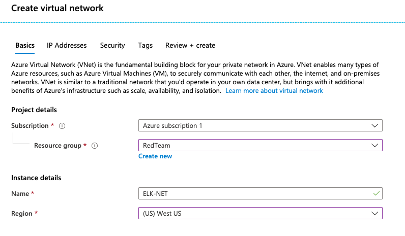

Here we are adding it to the `(US) West US` region because all the other resources are in the `(US) East US` region. 

  - Note that _which_ region you select is not important as long as it's a different US region than your other resources.

    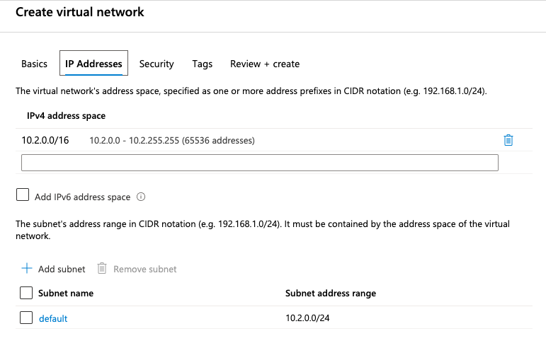

- Leave the rest of the settings at default.
	
  - Notice, in this example, that the IP Addressing has automatically created a new network space of `10.2.0.0/16`. If your network is different (10.1.0.0 or 10.3.0.0) it is ok as long as you accept the default settings. Azure automatically creates a network that will work.

   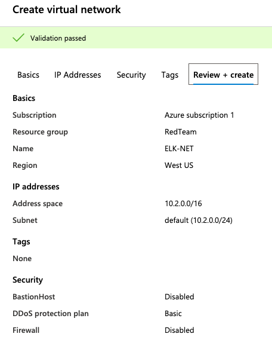

- Create a Peer connection between your vNets. This will allow traffic to pass between your vNets and regions. This peer connection will make both a connection from your first vNet to your Second vNet _And_ a reverse connection from your second vNet back to your first vNet. This will allow traffic to pass in both directions.

- Navigate to 'Virtual Network' in the Azure Portal. 

- Select your new vNet to view it's details. 

- Under 'Settings' on the left side, select 'Peerings'.

- Click the `+ Add` button to create a new Peering.

   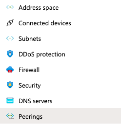

- Make sure your new Peering has the following settings:

	- A unique name of the connection from your new vNet to your old vNet.
		- Elk-to-Red would make sense

	- Choose your original RedTeam vNet in the dropdown labeled 'Virtual Network'. This is the network you are connecting to your new vNet and you should only have one option.

	- Name the resulting connection from your RedTeam Vnet to your Elk vNet.
		- Red-to-Elk would make sense

- Leave all other settings at their defaults.

  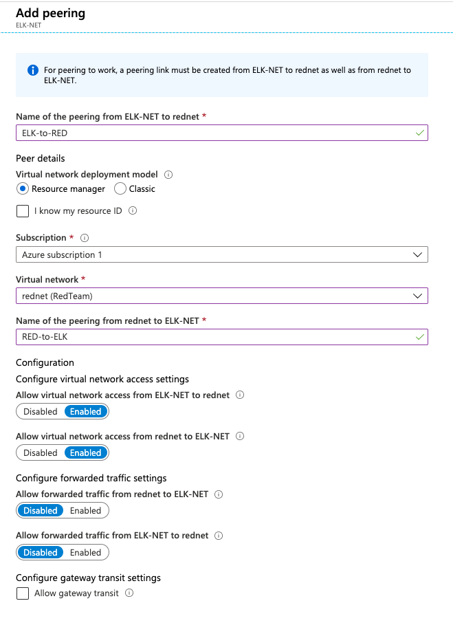

  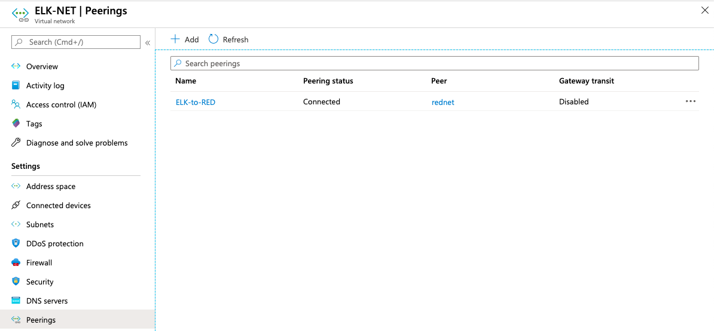

### 2. Creating a New VM

Set up a new virtual machine to run ELK.

- SSH into your Jump-Box using `ssh username@jump.box.ip`

- Check for your Ansible container:
 
  ```bash
  sysadmin@Jump-Box-Provisioner:~$ sudo docker ps
  CONTAINER ID        IMAGE               COMMAND             CREATED             STATUS              PORTS               NAMES
  ```

- Locate the container name:

  ```bash
  sysadmin@Jump-Box-Provisioner:~$ sudo docker container list -a
  CONTAINER ID        IMAGE                          COMMAND             CREATED             STATUS                      PORTS               NAMES                     
  4d16db8c80d6        cyberxsecurity/ubuntu:bionic   "bash"              3 days ago          Exited (0) 3 days ago    											 romantic_noyce
  ```

- Start the container:

  ```bash
  sysadmin@Jump-Box-Provisioner:~$ sudo docker container start romantic_noyce
  romantic_noyce
  sysadmin@Jump-Box-Provisioner:~$
  ```

- Connect to the Ansible container:

  ```bash
  sysadmin@Jump-Box-Provisioner:~$ sudo docker container attach romantic_noyce
  root@6160a9be360e:~#
  ```

- Copy the SSH key from the Ansible container on your jump box:

  ```bash
    # cat ~/.ssh/id_rsa.pub 
  ssh-rsa AAAAB3NzaC1yc2EAAAADAQABAAABAQDUfoIGFxTFyZXWV0QuCCmPKxsvGhnW/sKwGrOZ/K7nozKxsaRSCSG/oLGbugTyi9+fRY9wYWCmK/HLpjOaTEi8iU+ydvGM8nTloD/dIlje9PClUCxFQjql2XyQz32FqDjHV8rCZA+Pz+9ozc7BogQwLLg/0c4beQYbVQPKs1QGHf31YuXs6hAraJMXCx7VsDJHQwfv1kScE2s+yGeUJMt0ny3xaED8y2Pn+mBF2Tw7HLT+HPkmvXcuCkLxo6gY3ad+EH9Ko0r2AEFvtZTcFyGfIDLcS6jo+GUlKuCLGRAzeKNhq+D78fHf8Vt4qvUSIywP9HHnvnqfUCVKXsKxZGGl root@6160a9be360e

  ```

- Configure a new VM using that SSH key.
    - Make sure this VM has at least 4 GB of RAM.
    - Make sure it has a public IP address.
    - Make sure it is added to your new vNet and create a new Security Group for it.

- Solutions:
  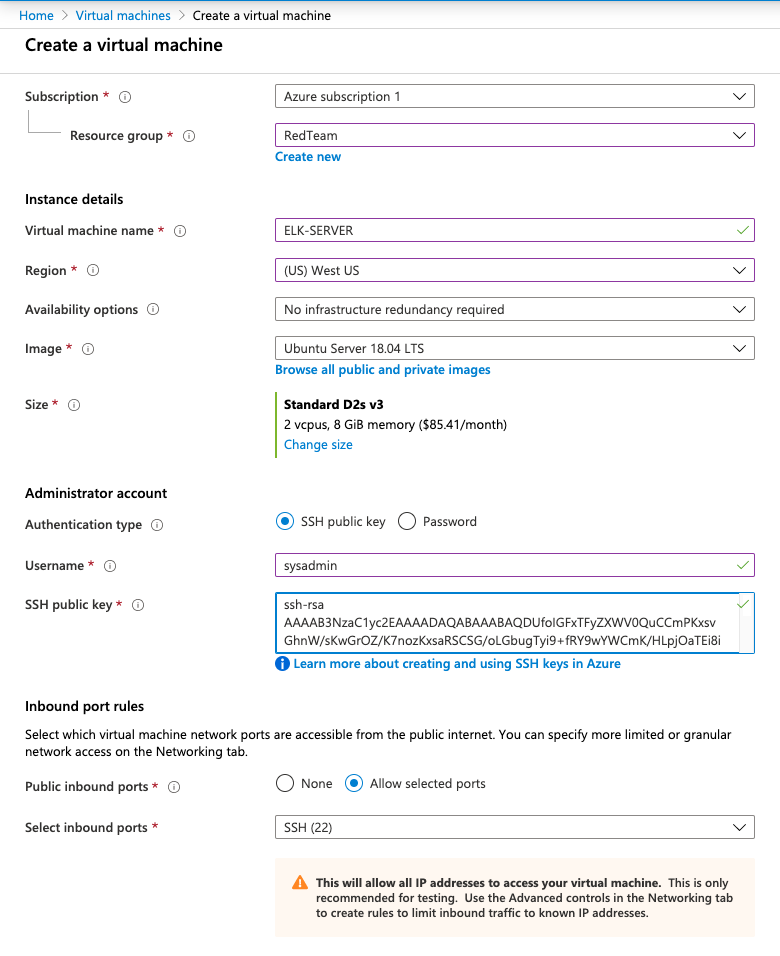
  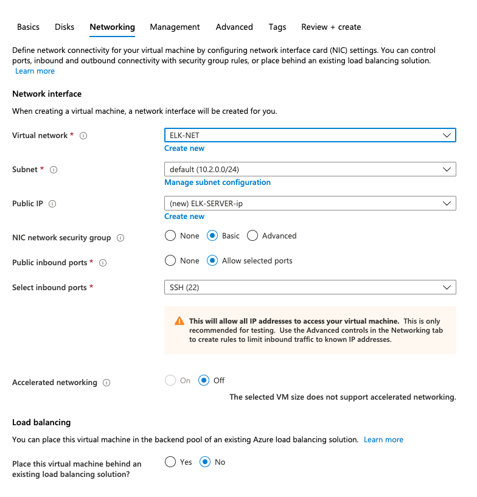

#### 3. Downloading and Configuring the Container
In this step, you had to:
- Add your new VM to the Ansible `hosts` file.
- Create a new Ansible playbook to use for your new ELK virtual machine.
    - The header of the Ansible playbook can specify a different group of machines as well as a different remote user (in case you did not use the same admin name):

      ```bash
      - name: Config elk VM with Docker
        hosts: elkservers
        remote_user: elk
        become: true
        tasks:
      ```
    
    - Before you can run the elk container, we need to increase the memory:

    ```yaml
    - name: Use more memory
      sysctl:
        name: vm.max_map_count
        value: '262144'
        state: present
        reload: yes
    ```
    - This is a system requirement for the ELK container. More info [at the `elk-docker` documentation](https://elk-docker.readthedocs.io/#prerequisites).
    - The playbook should then install the following services:
      - `docker.io`
      - `python3-pip`
      - `docker`, which is the Docker Python pip module.

#### 4. Launching and Exposing the Container 

After Docker is installed, download and run the `sebp/elk:761` container.
  - The container should be started with these published ports:
    - `5601:5601` 
    - `9200:9200`
    - `5044:5044`

Your Ansible output should resemble the output below and not contain any errors:

```bash
root@6160a9be360e:/etc/ansible# ansible-playbook elk.yml

PLAY [Configure Elk VM with Docker] ****************************************************

TASK [Gathering Facts] *****************************************************************
ok: [10.1.0.4]

TASK [Install docker.io] ***************************************************************
changed: [10.1.0.4]

TASK [Install python3-pip] *************************************************************
changed: [10.1.0.4]

TASK [Install Docker module] ***********************************************************
changed: [10.1.0.4]

TASK [Increase virtual memory] *********************************************************
changed: [10.1.0.4]

TASK [Increase virtual memory on restart] **********************************************
changed: [10.1.0.4]

TASK [download and launch a docker elk container] **************************************
changed: [10.1.0.4]

PLAY RECAP *****************************************************************************
10.1.0.4                   : ok=1    changed=8    unreachable=0    failed=0    skipped=0    rescued=0    ignored=0 
```

- SSH from your Ansible container to your ELK machine to verify the connection before you run your playbook.

- After the ELK container is installed, SSH to your container and double check that your `elk-docker` container is running.

Run `sudo docker ps`

```bash
sysadmin@elk:~$ sudo docker ps
CONTAINER ID        IMAGE               COMMAND                  CREATED             STATUS              PORTS                                                                              NAMES
842caa422ed8        sebp/elk            "/usr/local/bin/star…"   3 hours ago         Up 3 hours          0.0.0.0:5044->5044/tcp, 0.0.0.0:5601->5601/tcp, 0.0.0.0:9200->9200/tcp, 9300/tcp   elk
sysadmin@elk:~$
```

Solutions:
  - [Ansible Configuration File](Resources/ansible.cfg)
  - [Ansible Hosts File](Resources/hosts)
  - [ELK Playbook](Resources/install-elk.yml)

#### 5. Identity and Access Management
 
This ELK web server runs on port `5601`. Create an incoming rule for your security group that allows TCP traffic over port `5601` from your IP address.

Verify that you can load the ELK stack server from your browser at `http://[your.VM.IP]:5601/app/kibana`.

Solutions:
Sending traffic to the entire ELK-NET is fine here because there are no other resources besides the ELK server.

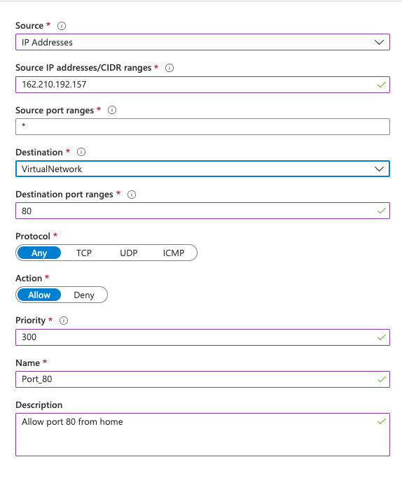

You can also choose to send traffic _only_ to the ELK server.

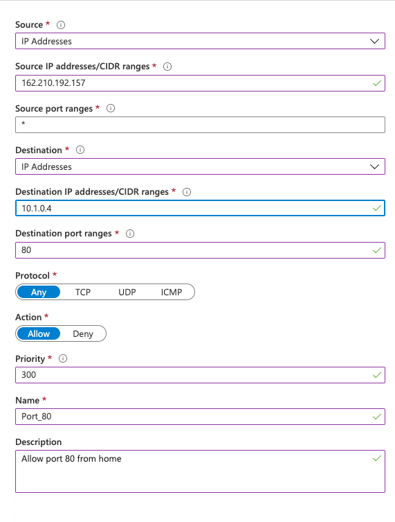

If everything is working correctly, you should see this webpage:

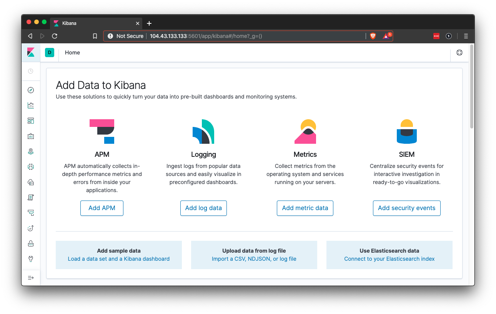

---
© 2020 Trilogy Education Services, a 2U, Inc. brand. All Rights Reserved.  